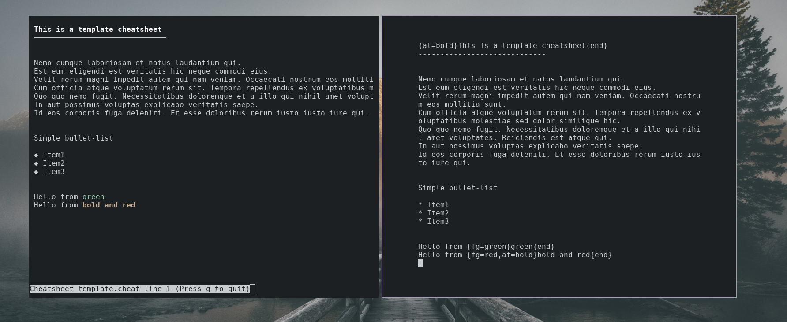

## cheat


Cheat is a python script for viewing self-written _cheatsheets_ about various topics in a man-page like manner.


### Installation

_Requirements_: curses 2.2 for Windows and Linux (comes pre-installed on Linux)

_Note_: its not tested on python3.X

**To install it on Windows:**
1) Download the curses wheel for windows: https://www.lfd.uci.edu/~gohlke/pythonlibs/#curses
2) pip install <curses-wheel>

**For Windows & Linux:**

just clone the repo and run the cheat.py script
```sh
git clone https://github.com/HansMartin/cheat.git
cd cheat
python cheat.py

Usage: python cheat.py <cheatsheet name>

Options:
    -l, --list     list cheatsheets
```


### Movement

* Move with the *Arrow-Keys* or *vim-bindings(HJKL)* through the file
* *g* to move curser to first line
* *G* to move curser to last line
* *0* to set position to (1/1)

## Cheatsheets

### Format of the Cheatsheets

Basically just plain ascii-text

Some specialities:

- "* "      : gets replaced with a bullet
- "- "      : gets replaced with a bullet
- "------"  : gets replaced with horizintal lines

lines starting with a "# " are automatically bold


### Format to colorize text:

Examples:

```
{fg=white,bg=black,at=normal}Default values{end}
{fg=blue,bg=red,at=underline}The text you wish to format{end}
{fg=blue}Some blue text{end} with some more text in that line
```


**Options:**
- fg (=foreground)
- bg (=background)
- at (=attribute)

**Available Colors:**
* Blue
* Cyan
* Green
* Magenta
* Red
* White
* Yellow

**Available Attributes:**
* normal
* __bold__
* unterline


### Screenshot


